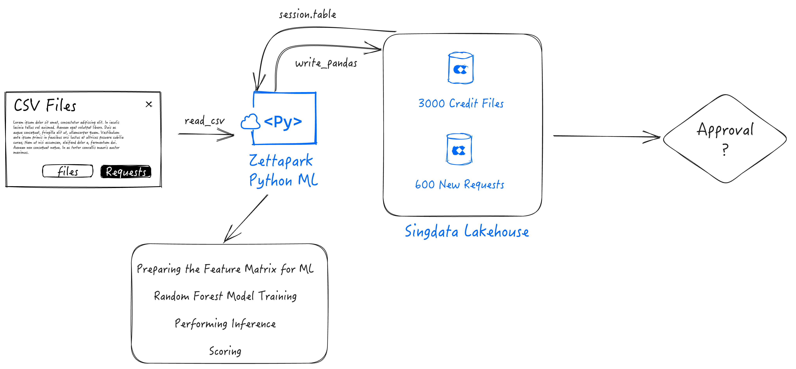

# Credit Scoring with Zettapark and Python ML library

## Overview

In this step by step tutorial, you will be able to use Zettapark for Python, along with your favorite python libraries for data analysis and visualization, as well as the popular scikit learn ML library to address an end to end machine learning use case.

### Prerequisite

* Singdata Lakehouse Account
* Client side Zettapark environment with Zettapark library installed. 

### What you'll learn

- Get an understanding on how to implement an end-to-end ML pipeline using Zettapark for Python.
- Develop using Zettapark for Python API,  vectorized Functions.
- Data Exploration, visualization and preparation using Python popular libraries (Pandas, seaborn).
- Machine Learning using scikit-learn python package
- Deploying and using an ML model for scoring using Zettapark for Python.

### Usage/Steps

* Step 1: Run through the Credit Scoring Setup Notebook. This will download the dataset, and create the database and tables needed for this demo. Make sure to customize config.json
* Step 2: You can now run the Credit Scoring tutorial.
